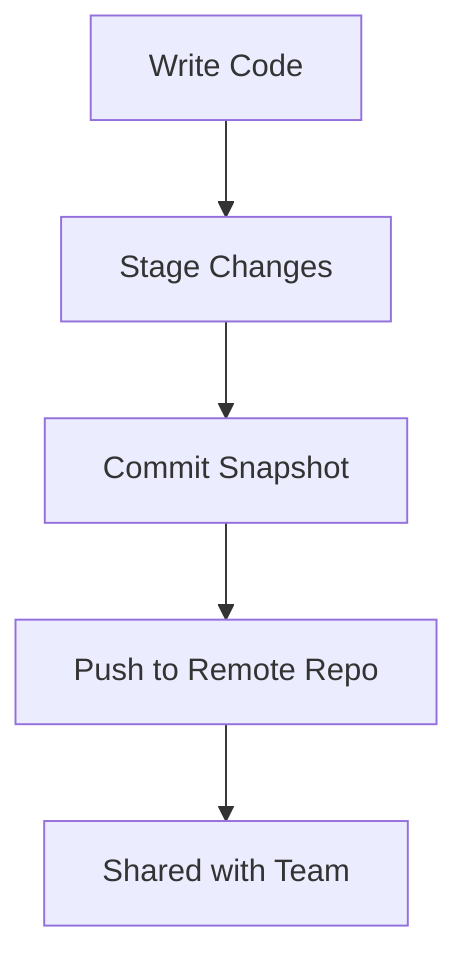
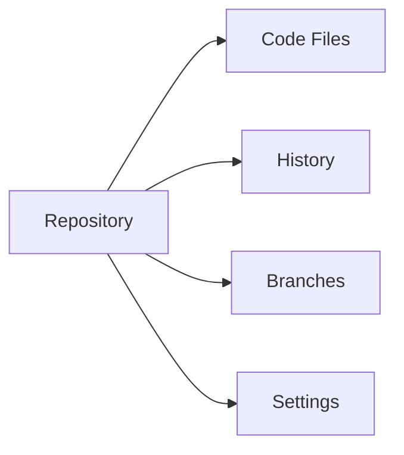
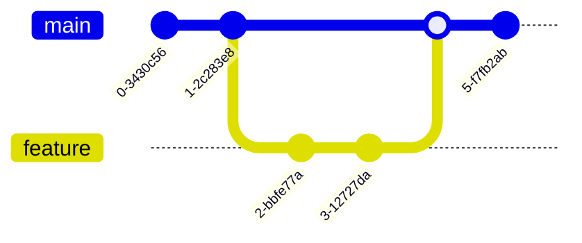
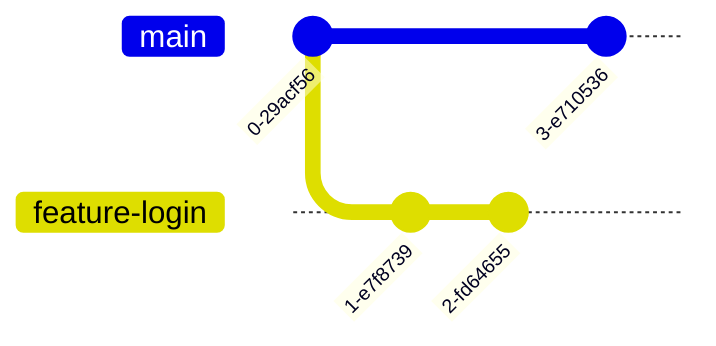
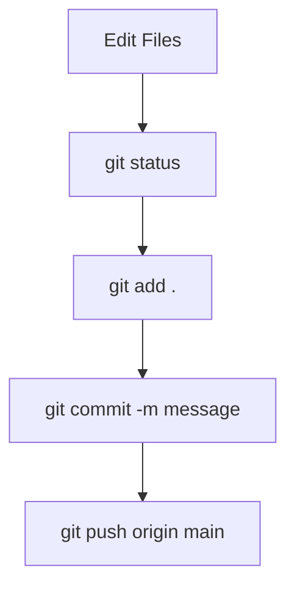
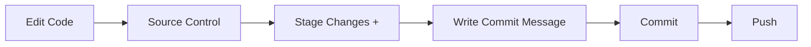

# 🚀 Git Fundamentals – Quick Cheat Sheet

## 📌 What is Git & Why is it used?

Git is a version control system that tracks changes in code over time.

### Why developers use it:
- Keeps history of changes
- Lets multiple people work together
- Allows rollback to previous versions
- Manages different features safely

---

## 🧠 Core Idea (Visual Flow)



---

## 📁 What is a Repository (Repo)?

A repo is a project folder tracked by Git.

It contains:
- Code files
- History of changes
- Branches
- Settings



---

## 🌿 What is `main`?

`main` is the default branch of a repo.

- Stable version of the project
- Usually production-ready code
- Updated after review/testing



---

## 🌱 What are branches?

Branches are separate copies of your project for working safely.

### Why use them:
- Work on features without breaking main
- Multiple people work in parallel
- Easy experimentation



---

## 🧾 How to commit code (VS Code + CLI)

### Flow:



### Commands:

```bash
git status        # check changes
git add .         # stage changes
git commit -m "message"   # save snapshot
git push origin main      # upload to GitHub
```

---

## 🧑‍💻 VS Code flow



---

## 🔥 Summary

- Git = version tracking system
- Repo = project storage
- main = stable branch
- branch = safe workspace
- commit = saved change snapshot
```
